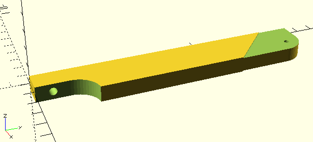
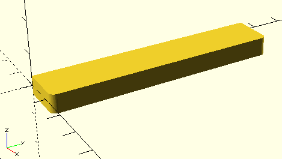

# finbases
OpenSCAD models for different types of fin bases, to be combined with [finFoil](http://hrobeers.github.io/finFoil/) 3D exports.

##LICENSE

 finbases by <a xmlns:cc="http://creativecommons.org/ns#" href="http://finfoil.io/" property="cc:attributionName" rel="cc:attributionURL">finfoil.io</a> is licensed under a <a rel="license" href="http://creativecommons.org/licenses/by-sa/4.0/">Creative Commons Attribution-ShareAlike 4.0 International License</a>.

## Contribute!
Contribute your fin bases or fin bases you know by:
* Opening an issue with technical drawings e.g. [Powerbox](https://github.com/hrobeers/finbases/issues/5)
* Modeling a fin base from [this list](https://github.com/hrobeers/finbases/labels/new%20base).
* Creating an OpenSCAD model of your fin base.

Contact me on [twitter](https://twitter.com/finfoil) or [swaylocks](http://www.swaylocks.com/users/hans) if you're unsure how to contribute trough github.

#### Contributors
* Hans Robeers (aka. [hrobeers](https://twitter.com/hrobeers), [hans](http://www.swaylocks.com/users/hans))
* [jrandy](http://www.swaylocks.com/users/jrandy)
* [RDM](http://www.swaylocks.com/users/rdm)

## Current status

### To be modeled
Check out [this list](https://github.com/hrobeers/finbases/labels/new%20base)

### Finished models

#### FCS

#### US box

#### Probox

#### Tuttle box

